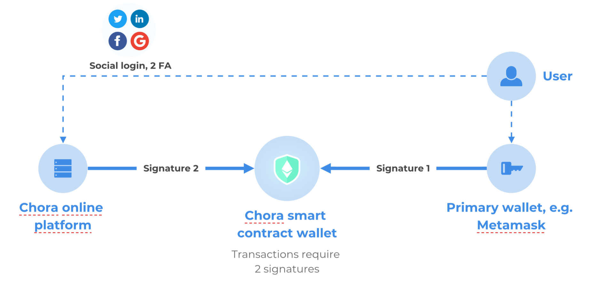

# Intro

Chôra supercharges non-custodial wallet security with social login, 2FA, and unmatched recoverability by letting the users delegate a part of security without giving away the custody of their assets.

With our smart contract, we eliminate the single point of failure and support recovery for worst cases (single-key recovery based on a time lock). We take care of the security partially (by operating a co-signing key) without taking over the custody of the account.

Technically, Chora smart contract is a 2-of-2 multi-sig wallet with time-lock-based recovery, where our secure infrastructure manages one key, and the user’s wallet manages the other key. The user’s key has a higher priority in the smart contract, so it will have an upper hand in case of conflicting recovery requests.

Regular Transactions in a Chora wallet must be signed by both the Chora platform and your owner wallet. Only then the smart contract accepts and executes them.

<figure><figcaption>
Chora wallet: regular transactions
</figcaption></figure>

If you lost or can't access the owner (primary) wallet, you can launch owner wallet recovery. The Chora smart contract will go into recovery mode and after the grace period, it will assign a new owner wallet to the smart contract.

&#x20;If you lose access to your email/2FA/Chora account, you can trigger a recovery that, after the grace period, will make your wallet decoupled from your Chora account. You could then "recouple" it with another account. This operation does not require a Chora signature and can be therefore triggered outside of your account using our open-source recovery tool or by invoking the smart contract's method by any other means.

<figure><figcaption>
Chora wallet: recovery
</figcaption></figure>

You can find more info and the link to the app on the main page [https://chora.cc](https://chora.cc)   &#x20;
